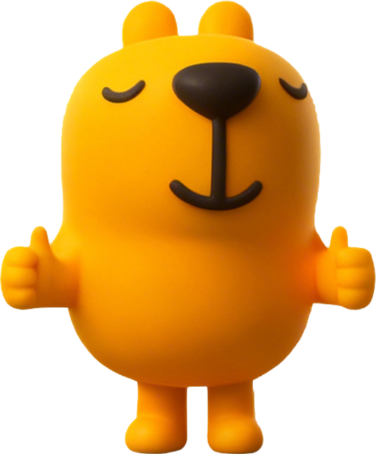
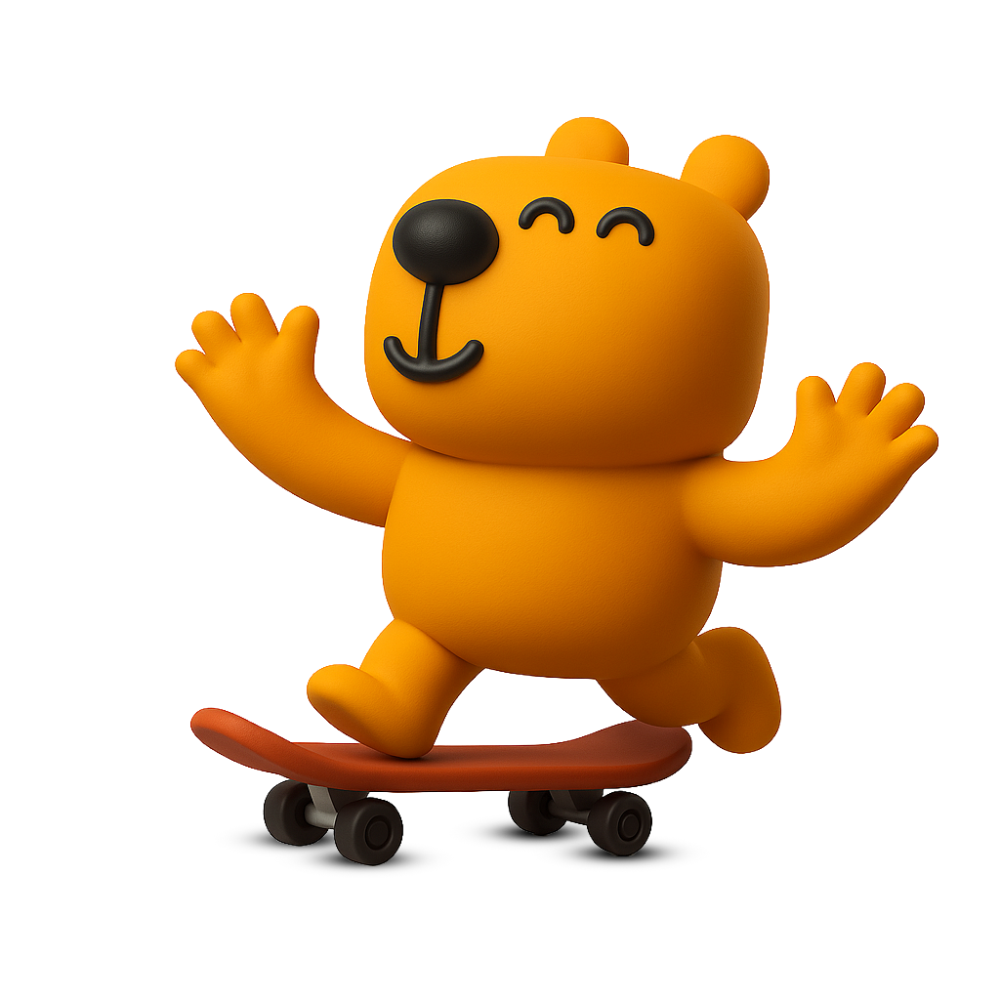

# Capitalizarme Design System

A reusable Open Design design-system package extracted from multiple real Capitalizarme sources —
brand tokens, component markup, the official iconset, logo family, and the full captured set of the
brand's "Capi" mascot renders. See Source references below for the complete evidence list.

## What you can build with this system

This package is a full brand kit, not just a landing-page skin — it has real tokens, an official
iconset, a full logo family, the Capi mascot, self-hosted type, and enforced-tool rules for every
output format below. Build any of these directly from `DESIGN.md` + `colors_and_type.css` +
`assets/`:

| Deliverable | Required tool / rule | Source |
|---|---|---|
| Web apps / product prototypes | Tailwind CSS, tokens bound into `tailwind.config` | `DESIGN.md` §13, `ui_kits/app-react/` (React), `ui_kits/app-astro/` (Astro), `ui_kits/app-svelte/` (Svelte) |
| Landing / marketing pages | Tailwind CSS + reusable section patterns | `DESIGN.md` §13, §5, `source-evidence/capitalizarme-boilerplate-html/components/` |
| Flyers / one-off marketing graphics | `colors_and_type.css` tokens + brand assets (logo, iconset, Capi) | `assets/logo/`, `assets/icons/iconset/`, `assets/mascot/` |
| Reports / business documents | paged.js, real `@page` rules, **US Letter default** | `DESIGN.md` §10 |
| Slide decks / presentations | reveal.js — no hand-rolled scaling/nav | `DESIGN.md` §11 |
| Charts / data visualizations | Chart.js — live `<canvas>` instances only | `DESIGN.md` §12 |
| Videos / motion content, brand intros | Hyperframes, full duration, real production effort | `DESIGN.md` §14 |

Every format shares the same source of truth: bind `colors_and_type.css`'s tokens (§2 palette, §3
type pairing), pull icons/logo/mascot from `assets/` per the quick-reference table above, and follow
the §9 anti-patterns (no invented figures, no guaranteed-returns language, no third typeface, no
squared-off buttons). See Reuse workflow below for the step-by-step process.

## Visual Preview


**Official palette — 2021 branding guidelines (`DESIGN.md` §2.1)**

|  |  |  |  |  |
|:---:|:---:|:---:|:---:|:---:|
| `--color-brand-navy` | `--color-brand-blue` | `--color-brand-gold` | `--color-brand-green` | `--color-brand-red` |
| backgrounds, titles | primary accent, links | AI / premium only | success | alerts, critical |

**Type pairing** — `Space Grotesk` (structure, self-hosted in `fonts/`) + `Raleway` (buttons/CTA only, bold uppercase)

**Official iconset** — `assets/icons/iconset/azul/` (see `preview/icons-iconset.html` for all 124, with color switcher + category filter)

<table><tr>
<td align="center"><br><sub>Property</sub></td>
<td align="center"><br><sub>Broker</sub></td>
<td align="center"><br><sub>Contract</sub></td>
<td align="center"><br><sub>Growth</sub></td>
<td align="center"><br><sub>Price</sub></td>
<td align="center"><br><sub>Parking</sub></td>
</tr></table>

**Capi mascot** — `assets/mascot/` (20 renders, always used whole, never recolored/cropped)

<table><tr>
<td></td>
<td></td>
<td></td>
<td></td>
<td></td>
</tr></table>

*This section is a static snapshot for GitHub. For live, token-bound previews (real CSS, not static images), open the cards in `preview/` — see the Preview Manifest below.*

## Product Overview

**Capitalizarme** is a Chilean real estate investment marketplace — it does **not** build or own
stock. It intermediates between real-estate developers ("inmobiliarias") who sell projects —
pre-construction / future delivery or already built — and individual investors who buy apartments
**as an investment**, via a
commercial network (Master Business Partner → Business Partner → Team Leader → Broker) and earns an
intermediation commission (commonly referenced around 3%, not a fixed platform-wide rate) at the
"promesa" milestone. See `DESIGN.md`'s intro for the full business-model detail.

The product's marketing mechanic is a **mortgage/investment-capacity simulator**: a visitor answers a
short contact form, books a free 45-minute consultation with a broker/advisor, and finds out how much
they can invest and which properties — apartments, land ("terrenos"), warehouses ("bodegas"), parking
("estacionamientos") — fit that capacity. The company runs this pitch across **multiple themed landing
pages** built from one shared component library. Beyond marketing, the real product surface set is the
Marketplace (project/unit catalog), Broker Center, Seller Center, Investor Center, and RPS
(reservation/promise system) — only the archived landing-page source and a webapp browse/invest
surface have source or an applied kit in this project; see the Preview Manifest and
`ui_kits/app-react/README.md` for what's evidenced vs. applied there.

Primary UI surfaces evidenced in source:
- Sticky header with logo + nav (`Header.astro`)
- Hero headline + investment-capacity pitch (`Hero.astro`)
- Contact form to book a consultation (`ContactForm.astro`)
- Bank/mutuaria and real-estate-partner callout panels (`ImageTextPanel.astro`, reused 3×)
- Featured investment project showcase with a checklist of terms (`FeaturedWork.astro`)
- 4-step "how it works" explainer grid (`Features.astro`)
- Closing CTA banner (`CTABanner.astro`)
- Footer with link columns, social, and a compliance disclaimer (`Footer.astro`)

Core capabilities evidenced by the source (`package.json`, `docs/superpowers/specs/`): the repo is an
Astro 5 + Tailwind CSS v4 static-site codebase (archived here as a frozen evidence snapshot — it's still
Capitalizarme's live production landing-page repo; `astro dev` / `astro build` / `astro preview`),
single-page, no CMS/routing, content centralized in `src/data/content.ts` so the same components could
be re-skinned per themed landing page.

### Source references

- `capitalizarme/capitalizarme-boilerplate-html` — **archived evidence snapshot**; still Capitalizarme's
  live production landing-page codebase, but this design system's implementation has surpassed its
  functionality, so it's captured here as a frozen reference rather than kept in sync. One codebase,
  captured via two intake paths that resolve to the same repository: the linked local folder
  `/Users/robertosalas/Proyectos/boilerplate-html` is a git clone of this exact repo (`origin` →
  `git@github.com:capitalizarme/capitalizarme-boilerplate-html.git`), so a GitHub-repo intake and a
  local-folder intake held byte-identical file snapshots — confirmed via `diff -rq`. The local folder was
  additionally cross-read directly to reach the full `src/components/*.astro` tree (preserved in
  `source-evidence/`), which the GitHub intake's file selection didn't cover on its own. Treat the two
  intake passes as one evidence source captured twice, not independent corroboration — the raw intake
  snapshots are not kept in this package, only the distilled results here and in `source-evidence/`.
- Figma — icon-sheet frame export, 6 color layers, **source of the official iconset**: the same
  flattened Figma frame exported as SVG six times — grayscale/ink (311 raw paths, no group/name
  metadata) plus 5 brand-color re-exports (verde/azul/rojo/amarillo/celeste). All 6 share pixel-identical
  grid geometry; split into 124 individual icon glyphs per color at `assets/icons/iconset/`
  (grayscale) and `assets/icons/iconset/{color}/` (5 color folders), index-matched by bounding-box
  position so `icon-NNN` is the same shape in every color. **This 124-glyph set is Capitalizarme's
  official iconset** for product UI — every glyph is now visually reviewed and semantically labeled
  (content name, category, confidence) in `assets/icons/iconset/labels.json`, so pick one by label or
  category instead of grid position — see `DESIGN.md` §6 and `preview/icons-iconset.html` (color
  switcher + category filter)
- Uploaded brand assets: real wordmark logo, a full logo color family (7 horizontal + 7 isotype color
  variants), and 20 "Capi" mascot renders, preserved in `assets/`
- A 2021 branding-guidelines cover page — pixel-sampled for its 5-color palette, **per company decision
  the only official brand palette source** (`DESIGN.md` §2.1) — plus a peer-provided text extraction of
  the full 117-page BrandBook it's excerpted from (Werner Fett Studio, 2020/2021; text only, source PDF
  not preserved). Together they carry the earliest documented rationale for the brand's multi-color
  system (same "más que tener un color corporativo…" quote in both) and the official iconset's
  rounded-terminal pictogram intent; the BrandBook alone contributed brand personality, logo
  construction/clear-space/minimum-size rules, and verbal-identity rules — see `DESIGN.md` §1, §6, §8.1.

## Package contents

```
DESIGN.md                Canonical rules doc — product context, color, type, spacing, layout,
                          components, motion, voice, anti-patterns
colors_and_type.css       Concrete design tokens + base styles. Space Grotesk/Raleway load from
                          Google Fonts CDN only (@import) — no local @font-face, no JS font loader
README.md                 This file
SKILL.md                  Agent-usable skill entry for reusing this system in future projects
LICENSE                    Copyright / usage terms for this package (Capitalizarme, all rights reserved)
assets/
  logo/                    favicon.png (default, black isotype) + favicon.svg (archived, provenance only) —
                            no separate root wordmark file; use horizontal/070726_logo-capitalizarme-negro-sin-com.png directly
    horizontal/            7 color variants of the horizontal lockup ("sin com" naming, dated 070726):
                            Azul, Azul Oscuro, Verde, Rojo, Amarillo, Negro, Blanco
    isotypes/               7 color variants of the standalone isotype (Azul, Celeste, Rojo, Amarillo,
                            Verde, Negro, Blanco)
  icons/                   The 4 real step icons used in the "how it works" section
    iconset/          OFFICIAL ICONSET (124 glyphs) extracted from a flattened Figma frame export
                            (grayscale/ink), plus manifest.json and labels.json (semantic name/
                            category/confidence per glyph) — see DESIGN.md §6
      verde/ azul/ rojo/    Same 124-icon grid re-exported in 5 brand colors, index-matched to the
      amarillo/ celeste/   grayscale set; manifest-colors.json has path/fill metadata per color
  mascot/                  All 20 captured "Capi" mascot renders
preview/                   10 focused, reviewable HTML cards (see Preview Manifest below)
components/                Copy-paste-ready HTML partials (markup + CSS), extracted from ui_kits/app-react/:
  header.html               Sticky top nav — wordmark + 3 links (from ui_kits/app-react/components/Header.jsx)
  footer.html                5-col link grid + legal/compliance disclaimer (from Footer.jsx)
source-evidence/           EVIDENCE — real Astro component source, copied out verbatim for direct
                            reading (ground truth: what the archived source actually contains)
  src/components/          Header, Hero, ContactForm, CTABanner, Features, FeaturedWork,
                            ImageTextPanel, Footer — verbatim from the linked repo
  src/layouts/Layout.astro Real <head> setup incl. the Google Fonts <link>
  src/pages/index.astro    Real section composition order
  src/data/content.ts      Real Spanish marketing copy
fonts/                     Real Space Grotesk (5 weights) + Raleway (Bold, BoldItalic) TTF files,
                            uploaded directly to the project and preserved as brand assets — not
                            bound in colors_and_type.css (fonts load from Google Fonts CDN only)
  manifest.json              Per-file family/weight/style manifest read by the Design System pane
ui_kits/app-react/       APPLIED — an invented "browse properties" webapp screen built from this
                            system's tokens, not extracted fact (see ui_kits/app-react/README.md).
                            React + Babel-standalone, no build step, browser-runnable.
ui_kits/app-astro/ APPLIED — the same invented screen, rebuilt as real .astro + Tailwind
                            components (see ui_kits/app-astro/README.md). Requires a Node/Astro
                            build step; meant to be dropped into an actual Astro codebase.
ui_kits/app-svelte/ APPLIED — the same invented screen again, rebuilt as real .svelte + Tailwind
                            components (see ui_kits/app-svelte/README.md). Requires a Node/Vite
                            build step; meant to be dropped into an actual Svelte codebase.
system/                    Design System pane assets — brand kit pages + 6 real artifact demos, all
                            token-driven, all loading colors_and_type.css
  kit.html / kit.dark.html   Condensed brand kit (palette, type, buttons, mascot) — light + the one
                            evidenced inverted/dark surface (CTA-banner navy treatment, not a
                            fabricated dark mode)
  index.html                  Overview linking to the kit pages and every artifact below
  tokens.default.json         Real tokens (color/type/spacing/radius/shadow/motion) as flat JSON
  artifacts/                Landing, deck cover, poster, email, newsletter, form page — each reusing
                            real Spanish copy from source-evidence/data/content.ts and real assets
```

`source-evidence/` vs `ui_kits/app-react/`/`ui_kits/app-astro/`/`ui_kits/app-svelte/` — these look
similar but serve opposite roles: `source-evidence/` is **evidence** (real code copied byte-for-byte
from the archived repo, safe to copy pixel-for-pixel); the three `ui_kits/` folders are an **applied
concept** (a plausible product screen this design system invented from its tokens, not proof
anything like it exists) — the same concept in three stacks, React (browser-runnable, zero setup)
vs. Astro + Tailwind vs. Svelte + Tailwind (the latter two match DESIGN.md §13 but need a build
step). Reach for `source-evidence/` when rebuilding a landing-page section exactly; reach for
whichever `ui_kits/` variant matches your target stack as a starting point for a new app surface,
not as a spec to match precisely.

No `build/` directory: the linked repo has no runtime/installer icon evidence (it's a static Astro
site, not an Electron/desktop app), so no root `build/` was fabricated.

`fonts/` holds both real brand fonts, uploaded directly to the project and preserved byte-for-byte:
Space Grotesk — 5 weights (Light 300, Regular 400, Medium 500, SemiBold 600, Bold 700) — and Raleway —
Bold (700, normal) + BoldItalic (700, italic), the only weight/style the button/CTA rule uses.
`colors_and_type.css` loads both from Google Fonts CDN only (`@import`) — the files in `fonts/` are
preserved as real brand assets and read by the Design System pane's Fonts module via
`fonts/manifest.json`, but are not bound via `@font-face` in `colors_and_type.css`.

## Preview Manifest

Every card loads `../colors_and_type.css` directly, so what you see is the real token output, not a
mockup.

| Path | Inspect | Demonstrates |
|---|---|---|
| `preview/colors-primary.html` | The official 2021 brand palette (navy/blue/blue-dark + red/gold/purple/green semantic set), evidenced status colors, and the landing-campaign variant, each as swatches with hex values and source notes | `--color-brand-navy`, `--color-brand-blue`, `--color-brand-blue-dark`, `--color-brand-red(-dark)`, `--color-brand-gold`, `--color-brand-purple`, `--color-brand-green`, `--color-off-white`, `--color-blue-light`, `--color-slate`, `--status-success/-warning/-danger` |
| `preview/colors-theme-light.html` | Surface roles (bg, card, tint panels) and text roles (body, emphasis, muted) side by side | `--bg`, `--surface`, `--surface-tint(-alt)`, `--fg`, `--fg-emphasis`, `--muted`, hairline borders |
| `preview/typography-specimens.html` | Live-rendered hero display, section heading, body copy, button label, footer title/legal, at real sizes | `--font-display` (Space Grotesk) vs `--font-accent` (Raleway, buttons only), full weight/size scale |
| `preview/spacing-tokens.html` | Spacing scale as measured bars, plus the container/section-rhythm diagram | `--space-*`, `--container-max/pad`, `--section-py(-lg/-xl)` |
| `preview/spacing-radius.html` | The 3 radii applied to real shapes (panel, card, pill button) | `--radius-sm`, `--radius-md`, `--radius-pill` |
| `preview/spacing-shadows.html` | Elevation levels on cards against a tinted background | `--shadow-sm` (evidenced) vs `--shadow-md`/`--shadow-lg` (derived) |
| `preview/components-buttons.html` | All 3 button variants (primary, on-accent, outline) with real copy | `.btn`, `.btn-primary`, `.btn-on-accent`, `.btn-outline` |
| `preview/components-inputs.html` | The real ContactForm reproduced with underline inputs | `.input-underline`, label spacing, `.card` wrapper |
| `preview/brand-assets.html` | Real primary wordmark, favicon, all 7 horizontal + 7 isotype logo color variants (each shown on its correct-contrast tile, incl. Verde and Azul Oscuro), 4 step icons, and all 20 mascot renders loaded via ``/`<object>` from `assets/` | `assets/logo/`, `assets/logo/horizontal/`, `assets/logo/isotypes/`, `assets/icons/`, `assets/mascot/` |
| `preview/icons-iconset.html` | **Capitalizarme's official iconset** — all 124 icon glyphs recovered from the flattened Figma frame export, each tile showing its semantic label and category, with a color switcher (6 layers) and a category filter (8 categories) | `assets/icons/iconset/icon-001.svg`…`icon-124.svg` (grayscale) + `{verde,azul,rojo,amarillo,celeste}/icon-001.svg`…`icon-124.svg`, `manifest.json`, `manifest-colors.json`, `labels.json` (content name, category, confidence per glyph) — filenames stay position-indexed, pick by label/category |
| `components/header.html` | Sticky header, live-rendered, with copy-paste markup + CSS blocks below the demo | `.app-header`, wordmark from `assets/logo/horizontal/`, `Header.astro` source pattern |
| `components/footer.html` | 5-column footer + legal disclaimer, live-rendered, with copy-paste markup + CSS blocks below the demo | `.app-footer`, wordmark from `assets/logo/horizontal/`, `Footer.astro` source pattern, DESIGN.md §8 disclaimer text |

## Reuse workflow

1. Start any new Capitalizarme-branded page or prototype by reading `DESIGN.md` in full — it has the
   product context, every token's source, and a §9 anti-patterns list worth checking before you
   improvise a component.
2. Copy `colors_and_type.css`'s `<link>` into your `<head>` (or paste its contents into your first
   `<style>` block) to get real tokens, base type, and the `.btn` / `.card` / `.input-underline` /
   `.nav-link` component classes for free.
3. Look at `preview/` for the exact visual target before building a new instance of an existing
   component (button, card, form).
4. For a new landing-page section, check `source-evidence/capitalizarme-boilerplate-html/components/` first — most sections
   (image+text panel, checklist card, step grid) already exist as a reusable pattern; re-skin with new
   copy via a `content.ts`-shaped object rather than inventing new markup.
5. For an applied product surface (not a marketing page), see `ui_kits/app-react/` (React, browser-runnable),
   `ui_kits/app-astro/` (real Astro + Tailwind, needs a build step), or `ui_kits/app-svelte/` (real
   Svelte + Tailwind, needs a build step) for a worked example of composing this system's tokens
   into a new screen — their READMEs cover what's evidenced vs. applied.
6. Use `assets/mascot/` for warmth in empty states or hero moments — always as a whole, uncropped
   image per `DESIGN.md` §6/§9.
7. Before publishing changes back to this design-system project, run:
   ```
   "$OD_NODE_BIN" "$OD_BIN" tools connectors design-system-package-audit --path . --fail-on-warnings
   ```
